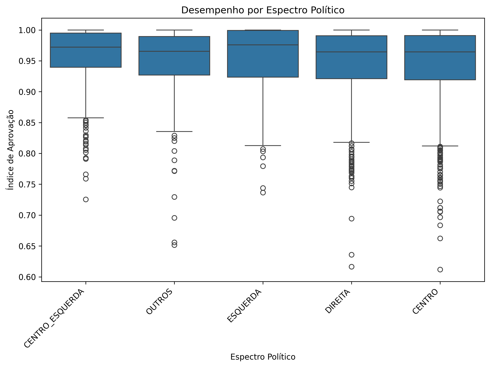
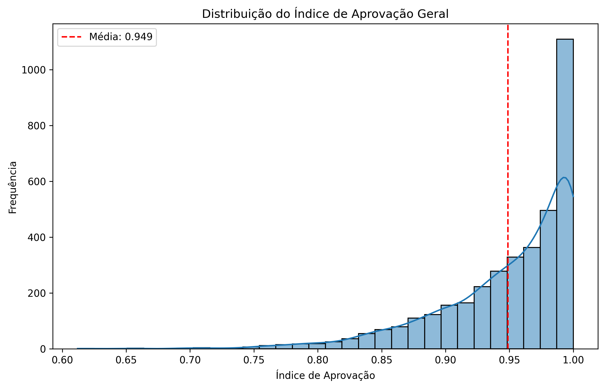
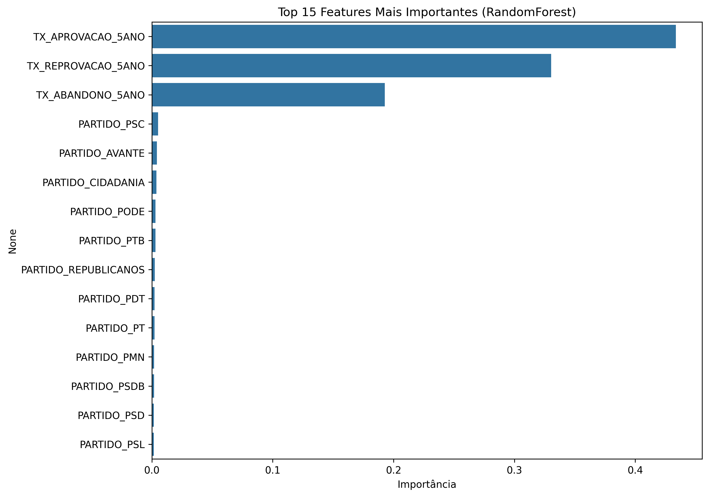

# Roteiro de Apresentação: Análise de Performance Educacional

**Tempo Estimado:** 10 minutos

---

### Slide 1: Título (1 min)

- **Título:** Análise da Influência do Espectro Político na Performance Educacional dos Municípios Brasileiros
- **Autor:** [Seu Nome]
- **Disciplina:** Engenharia de Sistemas Inteligentes (CK0444)
- **Introdução:** "Bom dia a todos. Hoje, vamos apresentar um projeto de MLOps de ponta a ponta que investiga uma questão complexa: existe uma correlação entre o espectro político da gestão municipal e o desempenho educacional de suas escolas? Para responder a isso, construímos um pipeline automatizado que coleta, processa, modela e serve esses dados."

---

### Slide 2: Arquitetura do Projeto (1.5 min)

- **Título:** Arquitetura de um Pipeline MLOps
- **Tópicos:**
    - "Nosso projeto foi dividido em três módulos principais, cada um com uma responsabilidade clara, todos orquestrados por um pipeline de CI/CD no GitHub Actions."
    - **1. Pipeline de Dados (`sdp-data`):** "O primeiro módulo é responsável por consumir dados brutos de duas fontes distintas: os dados de rendimento escolar do INEP e os resultados das eleições de 2020 do TSE. Ele limpa, transforma e combina esses dados, gerando um dataset unificado e pronto para análise."
    - **2. Pipeline de Modelo (`sdp-model`):** "O segundo módulo pega esse dataset e o utiliza para treinar e avaliar modelos de Machine Learning. O objetivo é classificar a performance de um município como 'Alta' ou 'Baixa'. Comparamos diferentes algoritmos e selecionamos um modelo campeão, que é salvo para uso posterior."
    - **3. Serviço de API (`sdp-service`):** "O último módulo expõe nosso modelo campeão através de uma API REST. Isso permite que qualquer aplicação cliente possa fazer predições em tempo real, enviando os dados de um município e recebendo a classificação de performance."
    - **Automação (GitHub Actions):** "Todo esse processo é automatizado. Qualquer alteração no código dispara o pipeline completo, garantindo que o projeto esteja sempre testado e funcional."

---

### Slide 3: Análise Exploratória dos Dados (2 min)

- **Título:** O Que os Dados Nos Dizem?
- **Tópicos:**
    - "Antes de modelar, é crucial entender os dados. Nossa análise exploratória revelou alguns padrões interessantes."
    - **Gráfico 1: Desempenho por Espectro Político**
        - "Este gráfico mostra a distribuição do nosso 'Índice de Aprovação' para cada espectro político. Podemos observar que, embora haja uma sobreposição considerável, existem diferenças nas medianas e nas distribuições. Por exemplo, [apontar uma observação, e.g., 'a faixa de desempenho dos municípios de Centro-Esquerda parece ser mais consistente']."
        - 
    - **Gráfico 2: Distribuição do Índice de Aprovação**
        - "Aqui, vemos a distribuição geral do nosso índice de performance. A maioria dos municípios se concentra em uma faixa de alta aprovação, com a média em torno de [mencionar a média]. Isso indica um desbalanceamento de classes que precisamos tratar na modelagem."
        - 

---

### Slide 4: Resultados da Modelagem (2.5 min)

- **Título:** Construindo o Modelo Preditivo
- **Tópicos:**
    - "O objetivo do nosso modelo é prever se a performance de um município será 'Alta' ou 'Baixa'. Para isso, comparamos dois modelos: Regressão Logística e RandomForest."
    - **Benchmark:** "O RandomForest se saiu melhor, com um score ROC AUC de aproximadamente 0.80, indicando uma boa capacidade de distinguir entre as duas classes."
    - **Gráfico 3: Importância das Features**
        - "Mas o que o modelo aprendeu? Este gráfico nos mostra as 'features' mais importantes para a predição."
        - "Podemos ver que [apontar a feature mais importante, e.g., 'a taxa de aprovação do 5º ano'] é, de longe, o fator mais preditivo. Isso faz sentido, pois o desempenho passado é um forte indicador do desempenho futuro."
        - "Interessantemente, a filiação a certos partidos, como [apontar um partido, e.g., 'PARTIDO_PSDB'], também aparece como um fator relevante, embora com um peso menor. Isso sugere que, embora a gestão anterior seja o fator principal, a afiliação política pode ter alguma influência secundária."
        - 

---

### Slide 5: Demonstração da API (1.5 min)

- **Título:** O Modelo em Ação: API de Predição
- **Tópicos:**
    - "Para tornar nosso modelo útil, nós o 'deployamos' como um serviço de API. Vou fazer uma demonstração rápida."
    - **(Executar o `service_cliente.ipynb` ou usar o `curl` ao vivo)**
    - "Aqui, estamos enviando os dados de um município hipotético para a nossa API... e aqui está a resposta."
    - **Mostrar a Resposta:** `{ "performance_label": "Alta", "prediction": 1, "probability": { "alta": 0.67, "baixa": 0.33 } }`
    - "A API nos retorna não apenas a classificação ('Alta'), mas também a probabilidade, o que nos dá um grau de confiança na predição. Este serviço poderia ser integrado em um painel de gestão pública, por exemplo."

---

### Slide 6: Conclusão (1.5 min)

- **Título:** Conclusões e Próximos Passos
- **Tópicos:**
    - **Conclusões:**
        - "Construímos com sucesso um pipeline MLOps completo e automatizado."
        - "O desempenho educacional anterior (taxas do 5º ano) é o preditor mais forte da performance futura."
        - "Embora existam diferenças estatísticas entre os espectros políticos, a filiação partidária específica se mostrou um fator preditivo secundário em nosso modelo."
    - **Próximos Passos:**
        - "**Enriquecer o Dataset:** Adicionar mais variáveis, como dados socioeconômicos (IDH, PIB per capita) e de investimento em educação por município, poderia revelar padrões mais complexos."
        - "**Modelos Mais Avançados:** Experimentar com modelos como Gradient Boosting (XGBoost, LightGBM) poderia melhorar a acurácia."
        - "**Deploy Contínuo:** Integrar o deploy da API ao pipeline de CI/CD, para que um novo modelo campeão seja automaticamente publicado."
- **Agradecimento:** "Obrigado pela atenção. Fico à disposição para perguntas."
